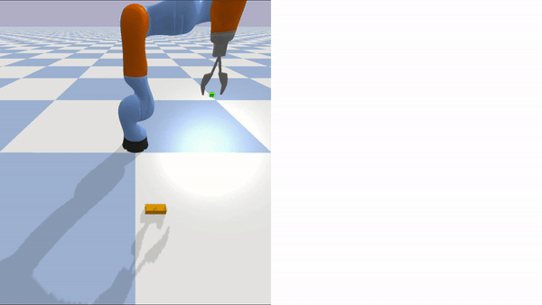
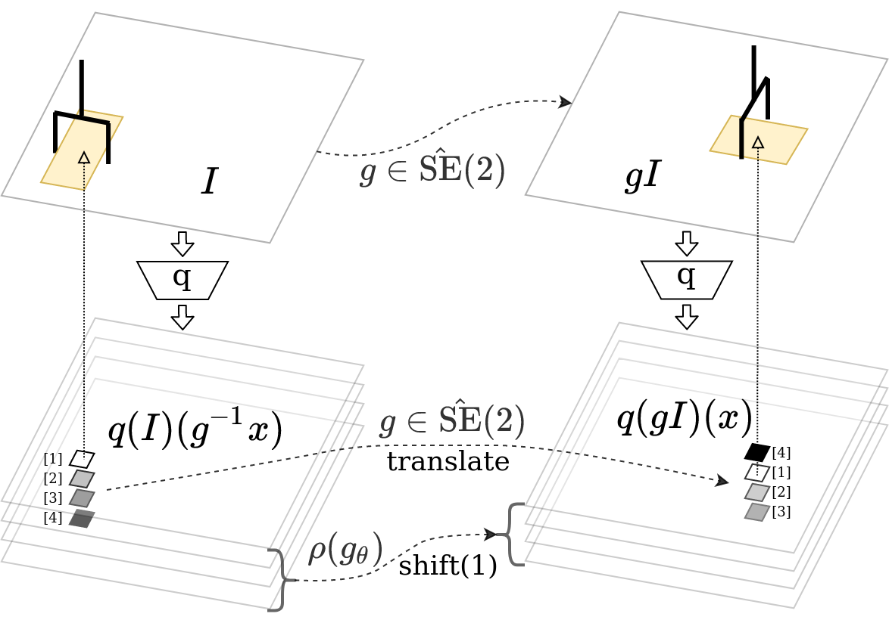
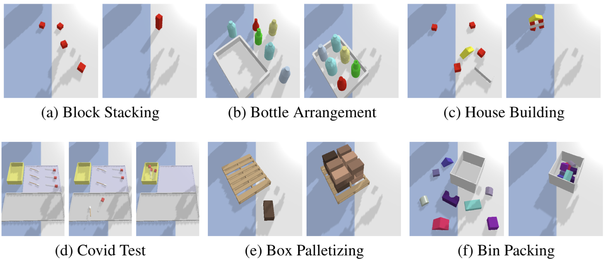
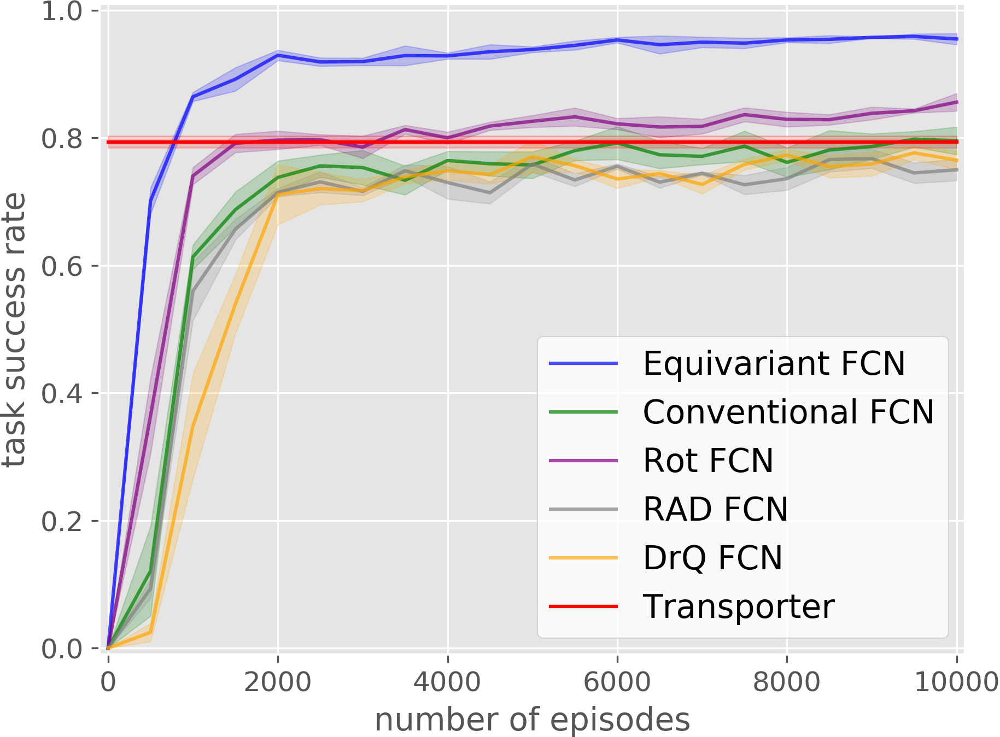
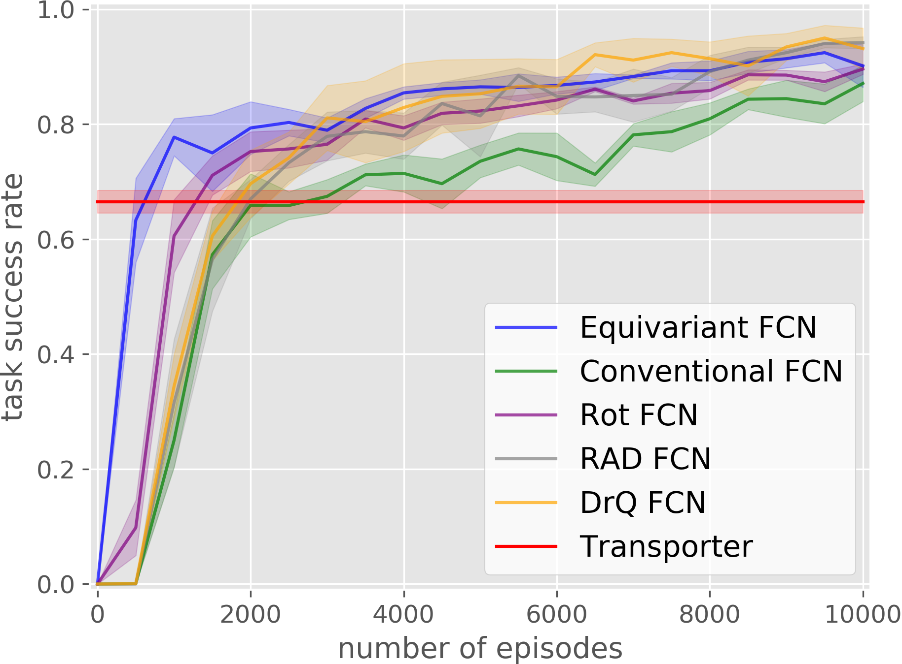
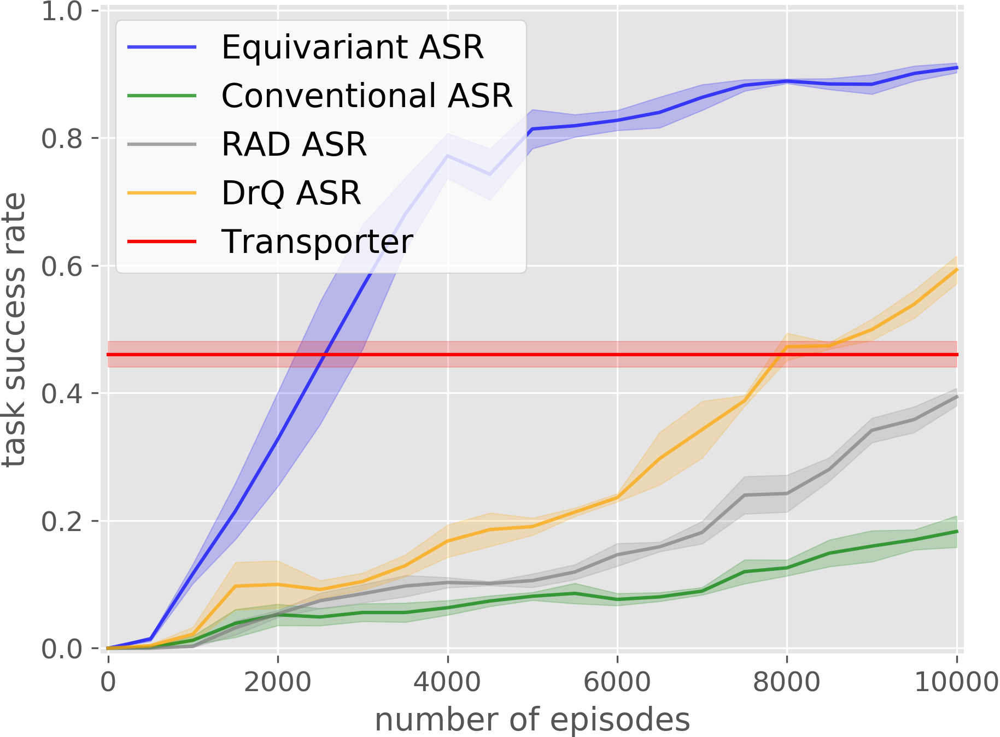
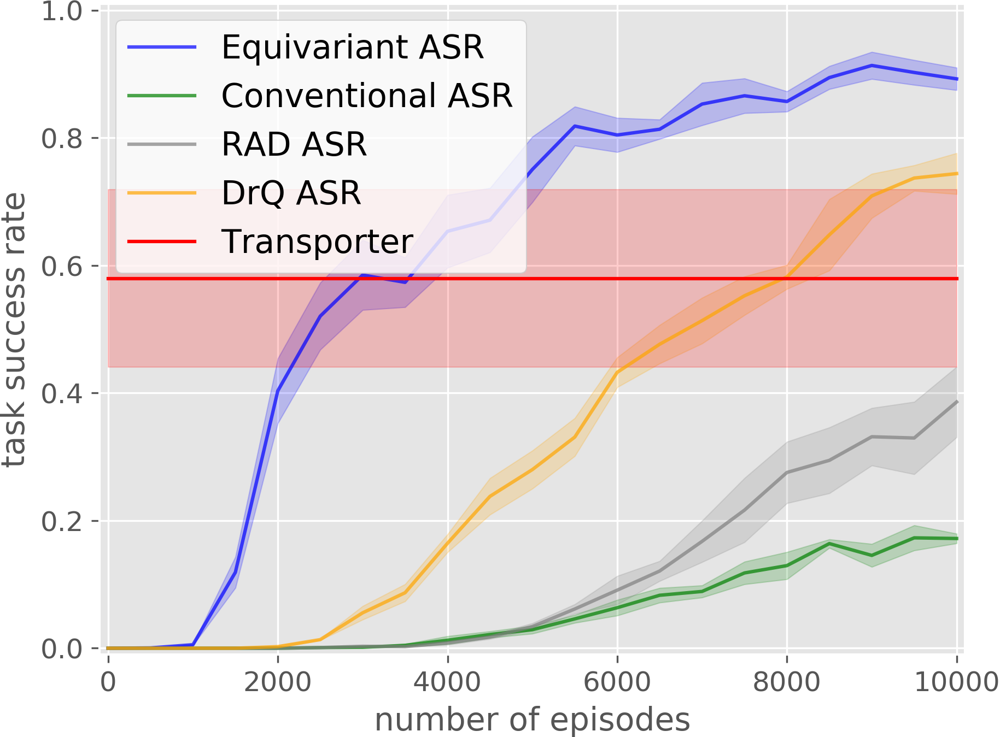
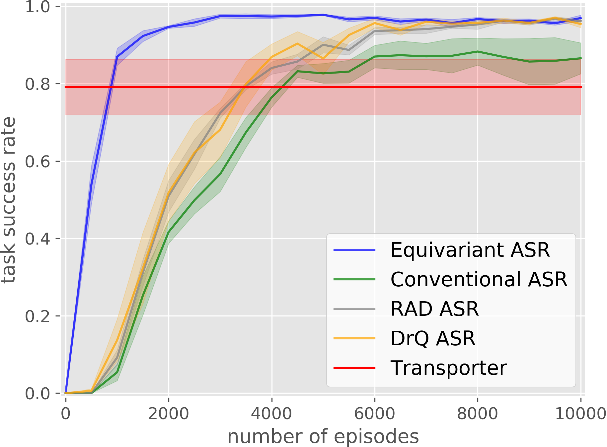
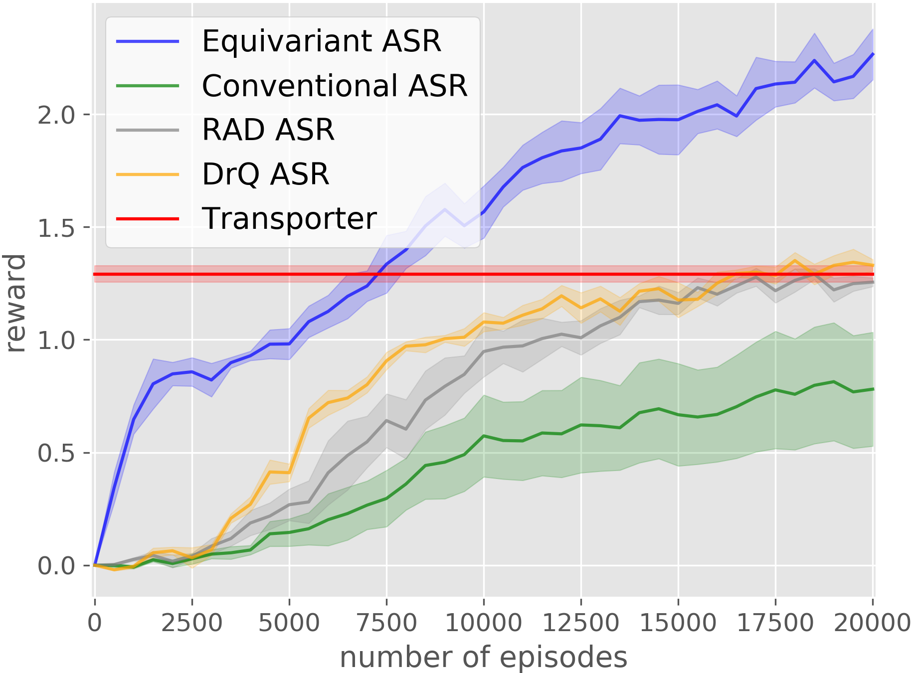

**Abstract:** Recently, a variety of new equivariant neural network model architectures have been proposed that generalize better over rotational and reflectional symmetries than standard models. These models are relevant to robotics because many robotics problems can be expressed in a rotationally symmetric way. This paper focuses on equivariance over a visual state space and a spatial action space -- the setting where the robot action space includes a subset of SE(2). In this situation, we know a priori that rotations and translations in the state image should result in the same rotations and translations in the spatial action dimensions of the optimal policy. Therefore, we can use equivariant model architectures to make Q learning more sample efficient. This paper identifies when the optimal Q function is equivariant and proposes Q network architectures for this setting. We show experimentally that this approach outperforms standard methods in a set of challenging manipulation problems. 

## Paper
<style>
.split {
  float: left;
  width: 50%;
}
</style>

<div>
  <div class="split">
  <p>Published at the Conference on Robot Learning (CoRL) 2021<br>
  <a href="https://openreview.net/forum?id=IScz42A3iCI">OpenReview</a><br>
  <a href="https://arxiv.org/abs/2110.15443">arXiv</a>
  </p>

  <p><a href="https://pointw.github.io">Dian Wang</a>, 
  <a href="http://mathserver.neu.edu/robin/">Robin Walters</a>, 
  <a href="https://www.khoury.northeastern.edu/people/xupeng-zhu/">Xupeng Zhu</a>, 
  <a href="http://www.ccs.neu.edu/home/rplatt/">Robert Platt</a></p>
  <p>Khoury College of Computer Sciences<br>
  Northeastern University</p>
  </div>
  
  <div class="split">
    <p><b>Poster</b></p>
    <p><a href="https://openreview.net/attachment?id=IScz42A3iCI&name=poster">

</a></p>
  </div>
</div>

## Paper
Published at the Conference on Robot Learning (CoRL) 2021  
[OpenReview](https://openreview.net/forum?id=IScz42A3iCI)
[arXiv](https://arxiv.org/abs/2110.15443)

[Dian Wang](https://pointw.github.io), 
[Robin Walters](http://mathserver.neu.edu/robin/), 
[Xupeng Zhu](https://www.khoury.northeastern.edu/people/xupeng-zhu/), 
[Robert Platt](http://www.ccs.neu.edu/home/rplatt/)

Khoury College of Computer Sciences  
Northeastern University

## Idea
<p align="center">
  
</p>

Robotic manipulation naturally has some equivariant properties. In this block picking example, when the scene is applied with an SE(2) transformation (e.g., rotate by 90 degrees), the optimal policy should also be applied with the same transformation. This work utilizes such equivariant property to accelerate Q learning.

<p align="center">
  
</p>

Specifically, in the case of DQN where the input is the manipulation scene and the output is the Q values of all actions, when the scene transforms, the Q map containing the value of all translational actions should also transform; the Q vector containing the value of all rotational actions should circularly permute. By enforcing such equivariant property, our method can solve challanging manipulation tasks much faster than competing baselines.

<style>
.column {
  float: left;
  width: 33.33%;
}
.lc{
  float: left;
  width: 16.66%;
}
.caption {
    margin: 0;
    vertical-align: baseline;
    text-align: center;
}
</style>

<p align="center">
  
  <p class="caption">The Experimental Environments</p>
</p>

The manipulation tasks of our experiments. The left subfigure shows the initial state and the right subfigure shows the goal state.

<div>
  <div class="lc">
    
    <p class="caption">Block Stacking</p>
  </div>
  <div class="lc">
    
    <p class="caption">Bottle Arrangement</p>
  </div>
  <div class="lc">
    
    <p class="caption">House Building</p>
  </div>
  <div class="lc">
    
    <p class="caption">Covid Test</p>
  </div>
  <div class="lc">
    
    <p class="caption">Box Palletizing</p>
  </div>
  <div class="lc">
    
    <p class="caption">Bin Packing</p>
  </div>
</div>

Our equivariant method (in blue) significantly outperforms the baselines in most experiments.

<div>
  <div class="column">
    
    <p class="caption">Bottle Arrangement</p>
  </div>
  <div class="column">
    
    <p class="caption">House Building</p>
  </div>
  <div class="column">
    
    <p class="caption">Box Palletizing</p>
  </div>
</div>

Our trained model can be applied in the real world.

## Video

<div style="text-align:center">
	<iframe width="853" height="480" src="https://www.youtube.com/embed/GtdpvjLHc_Q" frameborder="0" allow="autoplay; encrypted-media" allowfullscreen></iframe>
</div>

## Code

[https://github.com/pointW/equi_q_corl21](https://github.com/pointW/equi_q_corl21)

## Citation
```
@inproceedings{
wang2021equivariant,
title={Equivariant \$Q\$ Learning in Spatial Action Spaces},
author={Dian Wang and Robin Walters and Xupeng Zhu and Robert Platt},
booktitle={5th Annual Conference on Robot Learning },
year={2021},
url={https://openreview.net/forum?id=IScz42A3iCI}
}
```

## Contact
If you have any questions, please feel free to contact [Dian Wang](https://pointw.github.io) at wang[dot]dian[at]northeastern[dot]edu.
